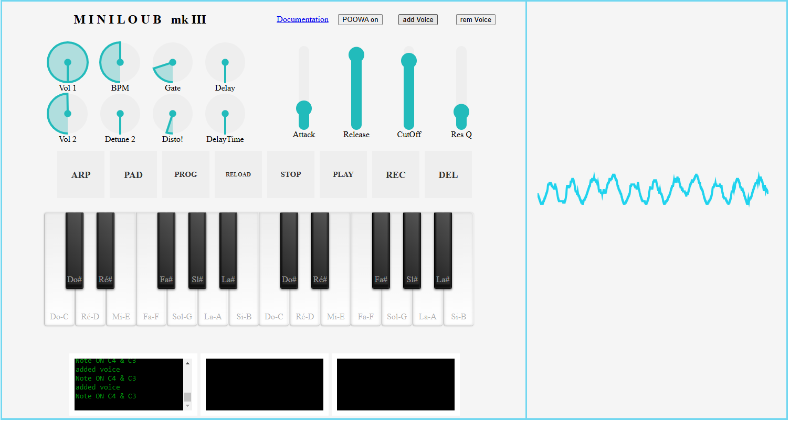

# The Mini Loub
Requires a physical Midi controler : the Arturia Minilab (c) 

## Purpose
Got a free synth wherever you go if you have your controler with you  
Can be played at :

https://erwandavid.github.io/theMiniLoub

## Documentation

- Plug your Arturia Minilab (c) to your computer using USB
- If need reload the page so that the controler is recognised
- This app use the default configuration of the Minilab (c) that can be selected on the device using SHIFT-PAD1
- You NEED to start the synth using the POWER button

## Components 
tone.js https://tonejs.github.io/    
simple-keyboard https://www.npmjs.com/package/simple-keyboard    
nexusUI https://nexus-js.github.io/ui/

+ html, css and javascript

## License 
Mozilla Public License Version 2.0
